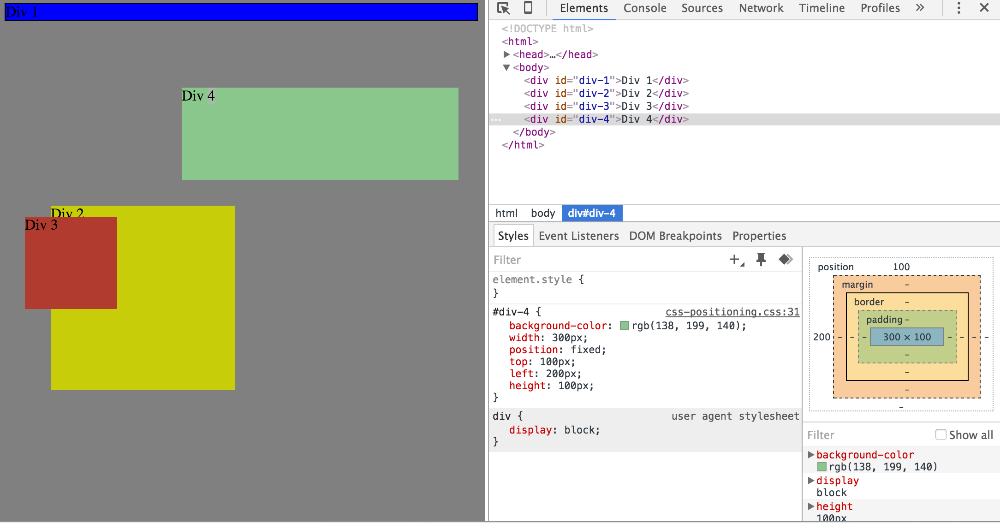

#3.4 Chrome DevTools

##Screen Shot

1. Change the Colors

2. Column

3. Row

4. Make Equidistant

5. Squares

6. Footer

7. Header

8. Sidebar

9. Get Creative

##Reflections

1. How can you use Chrome's DevTools inspector to help you format or position elements?

Chrome’s DevTools allows you to manipulate the CSS and see the results in real time. This means no need to go through the process of saving and reloading your files over and over each time you want to experiment with a change. By editing the styles section in chrome’s dev tools you can play with color, size, font, placement, width, height, etc.

DevTools displays the DOM structure of the current web page. The DOM tree is a tree of DOM nodes that represent individual HTML elements, such as <body> and 
. For ease of reading, the DOM tree view displays the HTML element tags instead of the DOM node types. Inspecting an element shows you the DOM nodes and CSS responsible for a rendered element in the browser.
The Elements panel lets you modify the DOM:
Edit a DOM node as HTML.
Add and remove individual DOM nodes.
Edit attribute names and values.
Move DOM elements
Updating the in-memory DOM tree doesn't modify the source files. Reloading the page erases any DOM tree modifications.

2. How can you resize elements on the DOM using CSS?

Once you know how to access the nodes within the tree of the DOM, double clicking will allow you to edit the CSS style directly in the elements window. From there resizing the element is as easy as adding - height: 5em; or width: 20em; between the curly brackets ({}) of your class or id.

3. What are the differences between absolute, fixed, static, and relative positioning? Which did you find easiest to use? Which was most difficult?

position:static;
The default positioning for all elements is position:static, which means the element is not positioned and occurs where it normally would in the document. Normally you wouldn't specify this unless you needed to override a positioning that had been previously set.

position:relative;
You can use top or bottom, & left or right to move the element relative to where it would normally occur in the document when you set position: relative.
position:absolute;
When you specify position:absolute, the element is removed from the document and placed exactly where you tell it to go.
position:fixed;
With position:fixed an element is specified at a point relative to the screen’s viewport and it will not move when you scroll.

The easiest position setting to use was position:absolute because it would go exactly where we told it to go no matter where any other elements were positioned. The most difficult position setting to use was position:static because it did not allow for easily manipulating the element’s position and would instead default the position of the element.

4. What are the differences between margin, border, and padding?

All of these settings are used to change the spacing of elements on the page. The difference between margin, border, and padding is:
 The margin specifies the space between an element and the top, bottom, or sides of a page.
The border property specifies the space surrounding an element, you can alter the border’s width, style, and color.
The padding properties set the size of the white space between the element content and the element border.

5. What was your impression of this challenge overall? (love, hate, and why?)

Overall I really appreciated this challenge for showing me an easy way to experiment with the CSS of my page and equipping me with invaluable tools for my career going forward.
