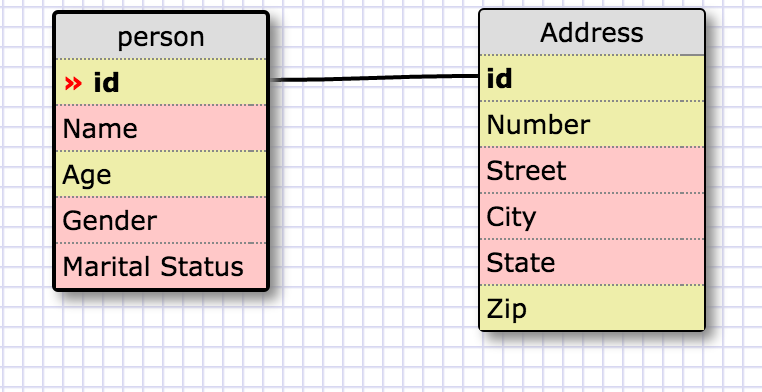
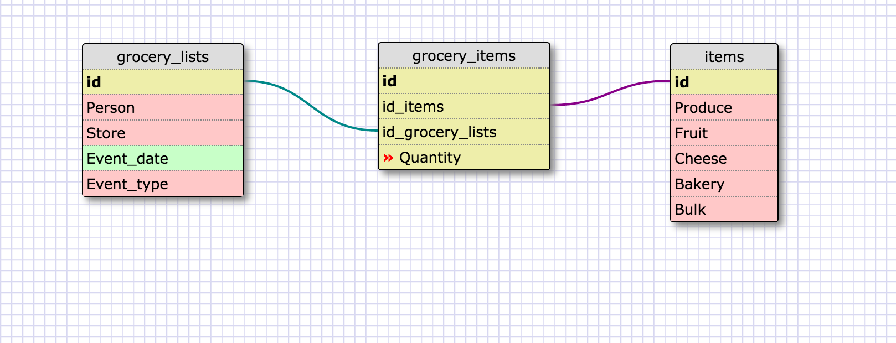

#8.5 More Schemas

##Reflections

####What is a one-to-one database?

####When would you use a one-to-one database? (Think generally, not in terms of the example you created).

In a one-to-one relationship, each row in one database table is linked to 1 and only 1 other row in another table. In a one-to-one relationship between Table A and Table B, each row in Table A is linked to another row in Table B. The number of rows in Table A must equal the number of rows in Table B.

This would be useful when trying to reduce overhead for retreiving information that is rarely used. For example, you could have one table listing individuals and another listing their height & weight.

####What is a many-to-many database?

In a many-to-many relationship, one or more rows in a table can be related to 0, 1 or many rows in another table. In a many-to-many relationship between Table A and Table B, each row in Table A is linked to 0, 1 or many rows in Table B and vice versa. A 3rd table called a mapping table is required in order to implement such a relationship.

####When would you use a many-to-many database? (Think generally, not in terms of the example you created).

In general you could use a many-to-many database when linking individuals to something they use often and have many of, such as a credit card, to the credit card companies the cards are issued through.

####What is confusing about database schemas? What makes sense?

Database schemas use pretty straightforward concepts at this point. I look forward to playing with more complicated examples involving complex databases with multiple relationships.